# Ball Space Game

---

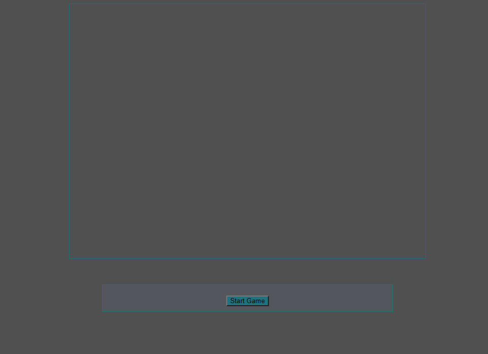

Po odpaleniu strony widzimy jedynie miejsce przeznaczone na widok gry oraz przycisk "Start Game".

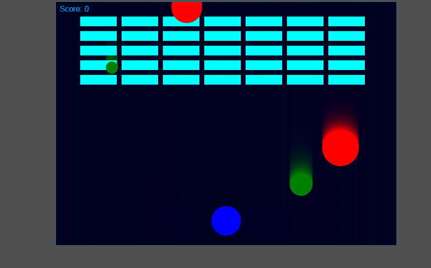

Po naciśnięciu przycisku ukazuje się plansza gry. Gracz steruje niebieską kulką. Używająć strzałek może poruszać się w prawo i lewo.

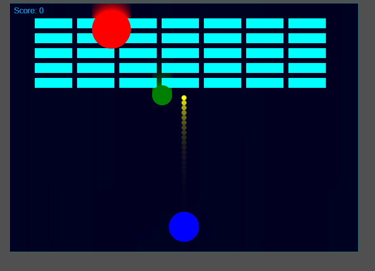

Naciskając spacje strzela żółtymi pociskami. Pociski mogą zniszczyć cegiełki w kolorze morskim. Dodatkowo z góry na dół spadają dwa rodzaje okrągłych głazów: zielone - które są niszczone przez pociski, czerwone - których zniszczyć się nie da. Rozmiar głazów jest wyliczany na podstawie wartości randomowej w pewnym zakresie. Głazy czerwone są zawsze większe od zielonych, ale są wolniejsze. Jeżeli zielony głaz uderzy w czerwony to niszczy się. Gracz wygrywa, gdy zniszczy wszystkie cegiełki, w momencie dotknięcia głazu przegrywa.

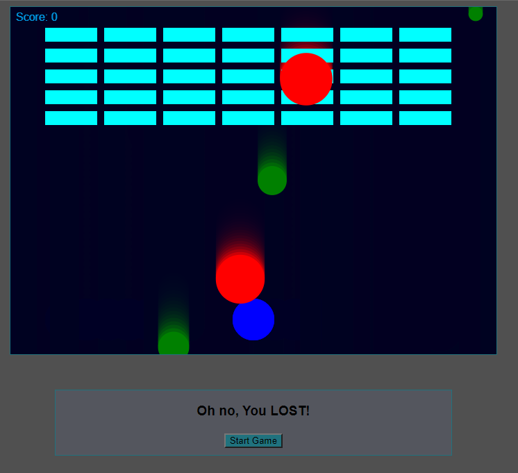

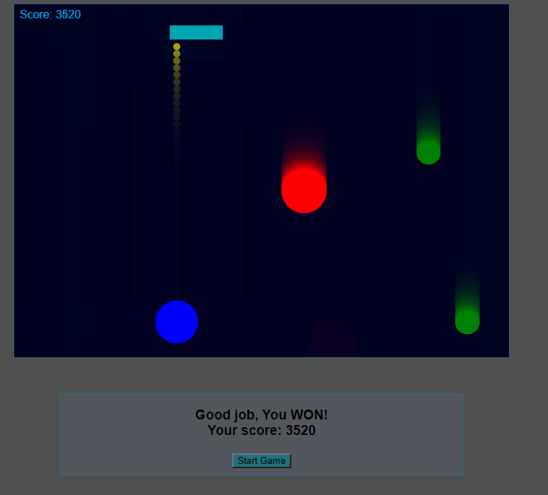

Za zniszczenie zielonego głazu otrzymuje 10 punktów, a za zniszczenie cegiełki 100 punktów.

---

# Kod Gry

---

**Class Player**

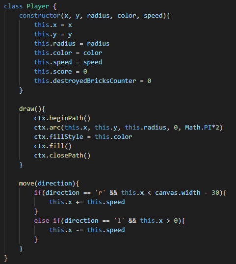

Główna klasa Player. Zawiera informacje o graczu:

- jego położenie x, y
- średnicę
- kolor
- prędkość
- zdobyte punkty
- ilość zniszczonych cegiełek

Dodatkowo posiada metodę draw, aby zostać wyświetlona oraz move do symulacji przemieszczania.

**Class Bullet**

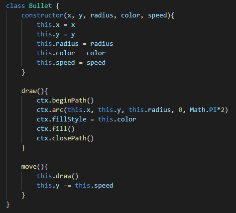

Klasa Bullet reprezentuje pocisk wystrzeliwany przez gracza. Zawiera te same właściwości co Player lecz bez punktów i ilości zniszczonych cegieł.

**Class Brick**

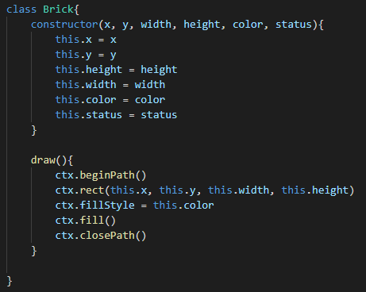

Klasa Brick reprezentuje pojedynczą cegiełkę. Posiada:

- informację o położeniu x, y
- szerokość i wysokość
- kolor
- status (1 oznacza bycie widocznym, 0 byciem zniszczonym)

Też posiada funkcję draw.

**Class Rock**

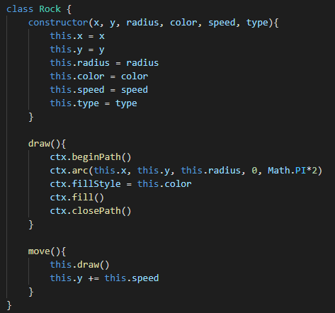

Klasa Rock reprezentuje pojedynczy głaz. Jest bardzo podobna do klasy Bullet z różnicą zwrotu przy poruszaniu się i posiadaniu właściwości type. Wartość 1 symbolizuje głaz zielony, a 2 głaz czerwony.

**Start Game Button**

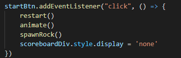

Po kliknięciu przycisku pierw następuje reset zmiennych, których wartość ulega zmianie podczas gry:

**function restart()**

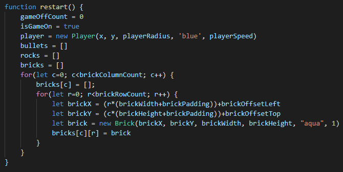

Tu też tworzone są wszystkie cegły.

Za animację ruchu odpowiedzialna jest funkcja animate:

**function animate()**

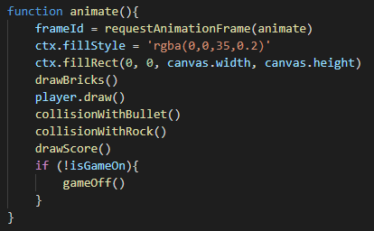

Co klatkę od nowa rysowana jest plansza, a na niej: cegiełki, gracz, sprawdzane są kolizje, wynik oraz sprawdzany jest status końca gry.

**function spawnRock()**

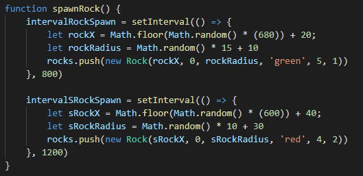

Po naciśnięciu Start Game uruchamiana jest tez runkcja spawnRock() odpowiedzialna za tworzenie nowych głazów. Głazy zielone tworzone są co 800ms, a czerwone co 1200ms. Ich rozmiar oraz położenie obliczane są przy pomocy funkcji rand w danym zakresie. Przechowywane są w jednej liście rocks.

**function drawBrick()**

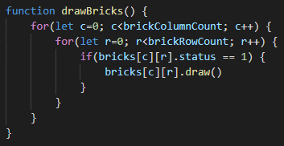

Funkcja drawBricks() odpowiedzialna jest za narysowanie cegiełek na planszy.

**function collisionWithBullet()**

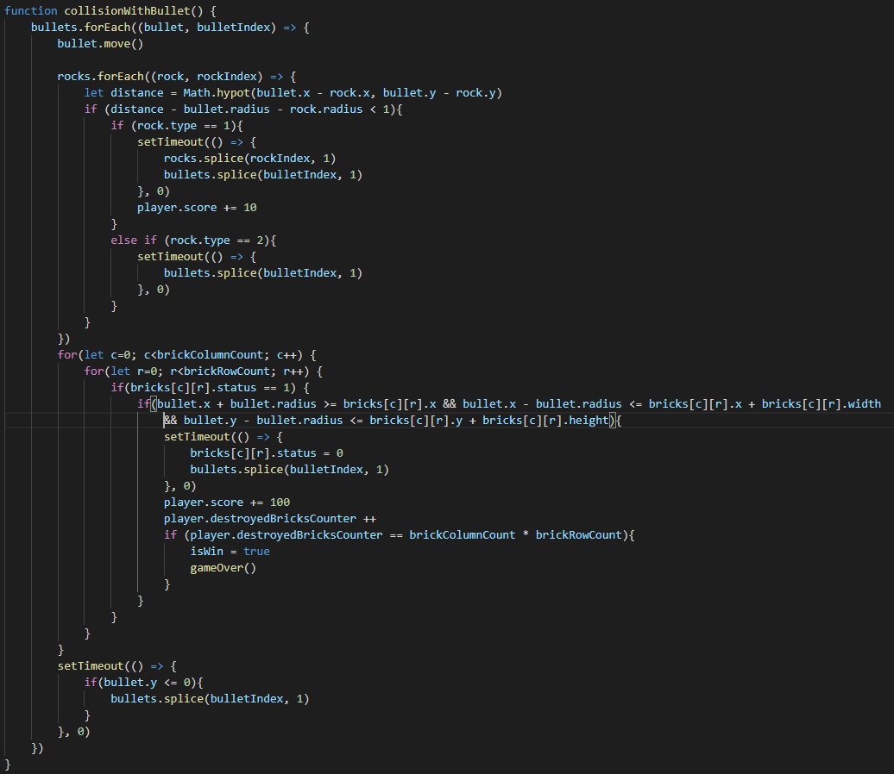

Funkcja dla każdego pocisku pierw inicjuje ruch. Następnie sprawdza odległość między danym pociskiem, a każdym głazem. Jeżeli jest mniejsza niż 1 to sprawdza typ głaza. Jeżeli jest to głaz zielony to głaz wraz z pociskiem są niszczone, a gracz dostaje punkty. Jeżeli jest to głaz czerwony to niszczony jest tylko pocisk.
Po sprawdzeniu wszystkich głązów sprawdzane jest czy pocisk nie uderzył w cegłe. Jeżeli tak to jej status zmieniany jest na 0, pocisk jest niszczony, a gracz otrzymuje punkty.

**function collisionWithRock()**

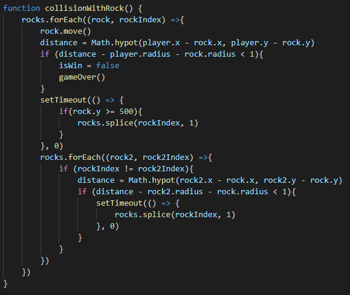

Funkcja sprawdza czy w gracza nie uderzył jakiś głaz lub czy głazy nie uderzyły same o siebie. Jeżeli głaz uderzył w gracza to uruchamiana jest funkcja gameOver() kończąca grę. Jeżeli głaz zielony uderzył w głaz czerwony to ten pierwszy jest niszczony.

**function drawScore()**

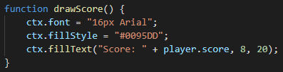

Funkcja rysuje aktualny wynik gracza.

**function keyDownHandler(e)**

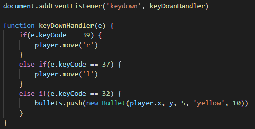

Funkcja sprawedza przy pomocy EventListenera czy na klawiaturze naciśnięty jest jakiś klawisz. Jeżeli naciśnięta jest strzałka w lewo to gracz porusz się w tę stronę, analogicznie do strzałki w prawo. Jeżeli naciśnięta jest spacja to tworzony jest obiekt klasy Bullet.

**function gameOver()**

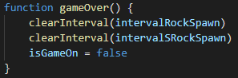

Funkcja zatrzymuje tworzenie nowych głazów, dodatkowo zmienia wartość zmiennej isGameOn na false przez co w funkcji animate() uruchamiana jest funkcja gameOff().

**function gameOff()**

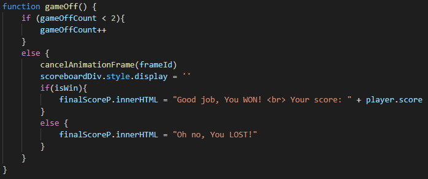

Funkcja umożliwia dwukrotne wykonanie się funkcji animate() po skończonej rozgrywce. Potem pauzuje animacje i wyświetla komunikat zależny od wygranej lub przegranej.
